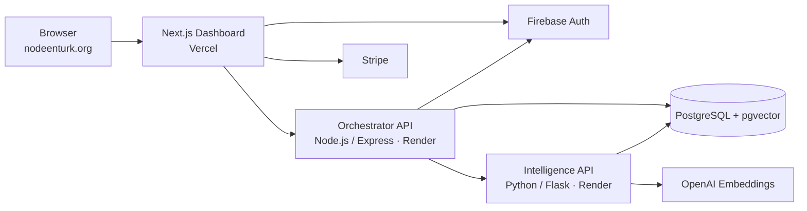

# TurkNode — AI-Powered Volunteer Matching Platform

> Matching skilled volunteers to urgent sustainability projects using semantic search over pgvector.

**Live:** [nodeenturk.org](https://nodeenturk.org) · [Orchestrator API](https://api.nodeenturk.org/healthz) · [Intelligence API](https://ai.nodeenturk.org/healthz)


TurkNode (Project Aequitas V2) is a production-deployed platform built for [ENTURK](https://nodeenturk.org), a sustainability nonprofit. Organizations post projects that need help; volunteers describe their skills in plain language; an AI matching service ranks the best volunteers for each project using OpenAI embeddings and cosine similarity search — no keyword tagging required.

<!-- TODO: add screenshot -->
<!--  -->

## Features

- **Semantic volunteer matching** — project descriptions are embedded and matched against volunteer skill profiles via pgvector cosine similarity
- **Impact ledger** — transactional contribution logging (hours, funds, deliverables) with evidence URLs and strict foreign keys
- **Project intake & applications** — public project posting, volunteer applications, and manager review workflows
- **Role-based access** — Firebase Auth with custom manager claims guarding review/approval endpoints
- **Donations** — Stripe payment intents with configurable amount limits
- **Production hardening** — per-route rate limiting, CORS allowlisting, Zod validation, health/readiness probes

## Architecture



Three services, one data layer:

| Service | Stack | Responsibility |
|---|---|---|
| `frontend-dashboard` | Next.js (App Router), TypeScript, Tailwind | Public site, volunteer & project-lead dashboards, Stripe donations |
| `backend-a-orchestrator` | Node.js, Express, Zod, pg | Business logic: volunteers, projects, applications, impact ledger, stats |
| `backend-b-intelligence` | Python, Flask, OpenAI API | Embedding generation + semantic match ranking over pgvector |
| `database` | PostgreSQL 16 + pgvector | Core entities, impact ledger, volunteer embedding vectors |

## Quickstart

Prereqs: Docker + Docker Compose.

```bash
git clone https://github.com/Jewettturkson/project-aequitas.git
cd project-aequitas
docker compose up --build
```

This boots everything with schema + seed data:

| Service | URL |
|---|---|
| Dashboard | http://localhost:3001 |
| Orchestrator API | http://localhost:3000/healthz |
| Intelligence API | http://localhost:8001/healthz |
| PostgreSQL | localhost:5432 |

By default the intelligence service runs with `MOCK_EMBEDDINGS=true` so no OpenAI key is needed. To use real embeddings:

```bash
export OPENAI_API_KEY="your-key"
export MOCK_EMBEDDINGS=false
docker compose up --build
```

Reset the database from scratch:

```bash
docker compose down -v && docker compose up --build
```

## API surface

Key endpoints (full request/response examples in [docs/OPERATIONS.md](docs/OPERATIONS.md)):

| Method | Endpoint | Description |
|---|---|---|
| `POST` | `/api/v1/volunteers` | Create volunteer profile (auto-indexes embedding) |
| `POST` | `/api/v1/projects/public` | Public project posting |
| `POST` | `/api/v1/projects/:id/applications` | Volunteer applies to a project |
| `PATCH` | `/api/v1/projects/:id/applications/:appId/status` | Approve/reject (manager role required) |
| `POST` | `/api/v1/contributions` | Transactional impact-ledger write |
| `GET` | `/api/v1/stats` | Live platform stats |
| `POST` | `/api/v1/match` (intelligence) | Rank top-K volunteers for a project description |

## Testing

```bash
cd backend-a-orchestrator && npm ci && npm test   # mocha + supertest + sinon (DB mocked)
cd backend-b-intelligence && pip install -r requirements.txt -r requirements-dev.txt && pytest
```

CI runs orchestrator tests, intelligence tests, and a full Next.js production build on every push.

## Design decisions

- **pgvector over a managed vector DB** — the embedding corpus lives beside relational data, so matching joins directly against `users` with one query and zero extra infrastructure.
- **Two backends** — Node handles transactional/relational work; Python owns the ML surface. They talk over a token-authenticated internal API.
- **Mock-embedding mode** — the whole stack runs offline for demos and CI without an OpenAI key.
- **Transactional ledger writes** — contributions run inside explicit transactions with `SET LOCAL` statement timeouts to avoid partial writes.

## Operations

Deployment, environment variables, Firebase role management, and migration order live in [docs/OPERATIONS.md](docs/OPERATIONS.md).

## License

[MIT](LICENSE) © Jewett Turkson
